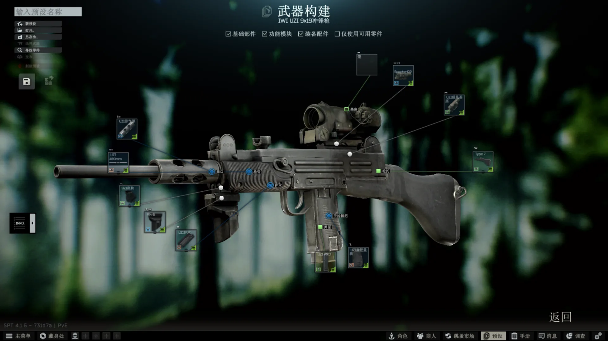
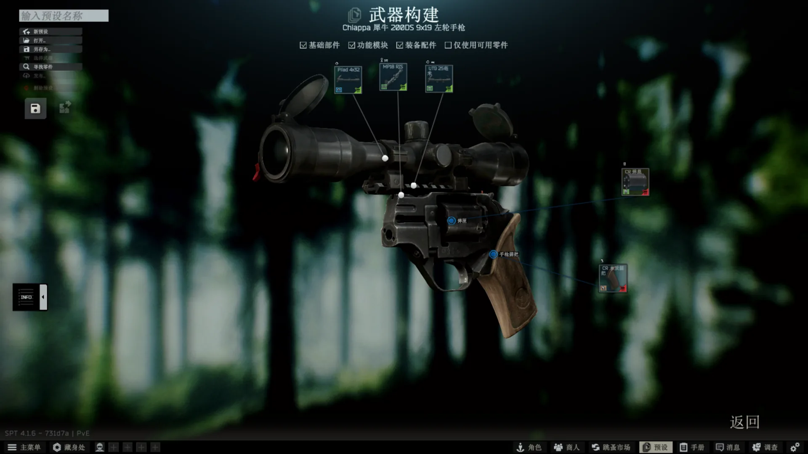
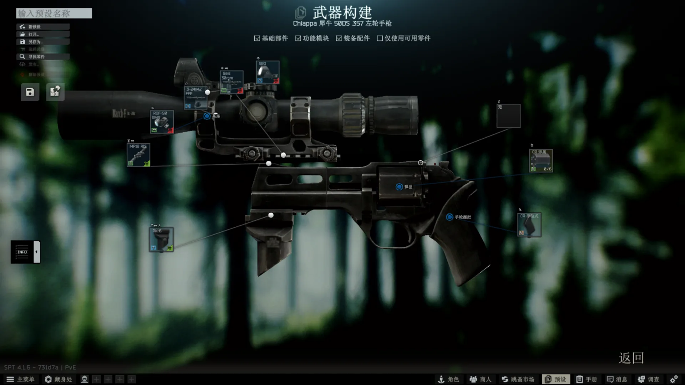
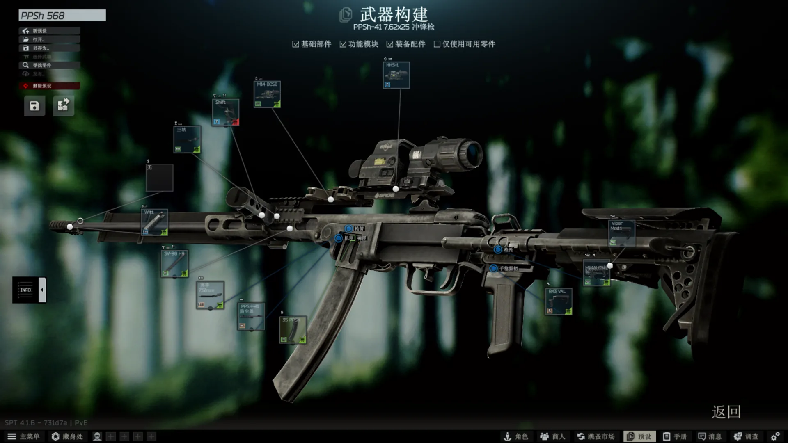

# PJ568's Weapon Cross Modding

> 一个 SPT 4.1.x 服务端插件：往目标物品槽的过滤器白名单里追加配件 id，让指定武器、瞄具、枪托与握把实现跨武器兼容。

本插件在服务端加载时，向目标物品槽的 `Slot.Properties.Filters[].Filter`（`HashSet<MongoId>`）白名单追加物品 id；
对互斥关系，则往 `TemplateItem.Properties.ConflictingItems` 追加物品 id。
所有注入均幂等：id 已存在时不重复添加。

## 效果

| UZI StormWerkz 顶盖导轨与护木底轨 | CR 200DS 前准星槽 |
| --- | --- |
|  |  |
| 顶盖导轨装 ELCAN SpecterDR；护木底轨装 RK 系列前握把。 | 前准星槽装 StormWerkz 顶盖导轨与 MP-18 瞄具基座。 |

| CR 50DS 前准星槽与战术设备槽 | PPSh-41 枪管与枪托槽 |
| --- | --- |
|  |  |
| 前准星槽装瞄具基座；战术设备槽装 RK 系列前握把。 | 枪管槽装莫辛 220mm / 514mm / 730mm、SKS / OP-SKS、SVT-40 625mm 枪管或 SVDS 照门固定环（并挂三轨）；SVDS 照门固定环的护木槽可装莫辛 200mm、M700、ORSIS T-5000M 或 SVDS 枪管，照门槽与 SKS / OP-SKS 照门固定环、SVT-40 625mm 枪管一样可装 TKPD 导轨防尘盖（该防尘盖与 SKS / OP-SKS / SVT-40 / AVT-40 / SVDS 枪本体互斥，SVDS 照门固定环另与 PPSh-41 防尘盖、TAPCO Intrafuse SKS 枪身套件互斥，其护木槽的原版 SVDS 护木与 PPSh-41 本体互斥）；枪托槽装 M14ALCS (MOD-0) 枪托与 Zveno 缓冲管转接器；上机匣槽装 TAPCO Intrafuse 或 Fab Defence UAS SKS 枪身套件；730mm 莫辛枪管与 SVT-40 标准枪口装置的准星槽可装 MDR BLK LBL ALX 脚架（16 / 20），AA-12 457mm 枪管的导轨槽可装 M60 脚架，MP-18 与 Marlin MXLR 的枪托槽可装 KS-23 金属枪托；此外 RPD 520mm 枪管的枪口装置槽可装 AKM PBS-1 消音器。 |

## 文档

- [功能与互斥](docs/features.md)
- [原理](docs/principle.md)
- [构建、测试与发布](docs/development.md)
- [实机验证](docs/verification.md)
- [兼容性与限制](docs/compatibility.md)

## 支持版本

SPT `4.1.x`。

## 许可证

[MIT](LICENSE)

%%%%%%%%%%%%%%%%%%%%%%%%%%%%%%%%%%%%%%%%%%%%%%%%%%%%%%%%%%%%%%%

# PJ568's Weapon Cross Modding

> An SPT 4.1.x server plugin that appends accessory ids to slot filter whitelists, enabling cross-weapon compatibility between selected weapons, optics, stocks and grips.

On load, the plugin appends item ids to the `Slot.Properties.Filters[].Filter` (`HashSet<MongoId>`) whitelist of the target item slots;
for mutual exclusions, it appends item ids to `TemplateItem.Properties.ConflictingItems`.
All injections are idempotent: an id already present is never added twice.

## Effect

| UZI StormWerkz top cover rail and lower handguard rail | CR 200DS front sight slot |
| --- | --- |
|  |  |
| The top cover rail takes an ELCAN SpecterDR; the lower handguard rail takes an RK-series foregrip. | The front sight slot takes the StormWerkz top cover rail and the MP-18 scope base. |

| CR 50DS front sight and tactical slots | PPSh-41 barrel and stock slots |
| --- | --- |
|  |  |
| The front sight slot takes a scope base; the tactical slot takes an RK-series foregrip. | The barrel slot takes a 220 / 514 / 730 mm Mosin, SKS / OP-SKS, SVT-40 625 mm barrel or the SVDS rear sight block (with the tri-rail mounted on it); the SVDS rear sight block's handguard slot takes a Mosin 200 mm, M700, ORSIS T-5000M or SVDS barrel, and its sight slot, like the SKS / OP-SKS rear sight blocks and the SVT-40 625 mm barrel, takes the TKPD railed dust cover (which is incompatible with the SKS / OP-SKS / SVT-40 / AVT-40 / SVDS weapons, and the SVDS rear sight block is additionally incompatible with the PPSh-41 dust cover and the TAPCO Intrafuse SKS chassis kit, while the vanilla SVDS handguards it accepts are incompatible with the PPSh-41 weapon itself); the stock slot takes the M14ALCS (MOD-0) buttstock and the Zveno buffer tube adapter; the upper receiver slot takes a TAPCO Intrafuse or Fab Defence UAS SKS chassis kit; the 730 mm Mosin barrel's and the SVT-40 standard muzzle's front sight slots take an MDR BLK LBL ALX bipod (16 / 20), the AA-12 457 mm barrel's rail slot takes an M60 bipod, and the MP-18 and Marlin MXLR stock slots take a KS-23 metal stock; additionally, the RPD 520 mm barrel's muzzle device slot takes an AKM PBS-1 suppressor. |

## Documentation

- [Features and conflicts](docs/features.md)
- [Principles](docs/principle.md)
- [Build, test and release](docs/development.md)
- [In-game verification](docs/verification.md)
- [Compatibility and limitations](docs/compatibility.md)

## Supported versions

SPT `4.1.x`.

## License

[MIT](LICENSE)

%%%%%%%%%%%%%%%%%%%%%%%%%%%%%%%%%%%%%%%%%%%%%%%%%%%%%%%%%%%%%%%
